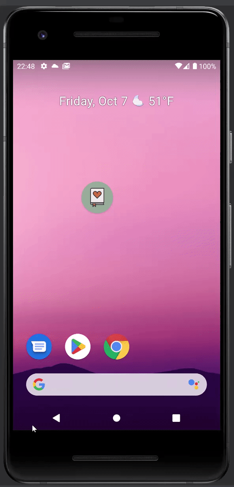
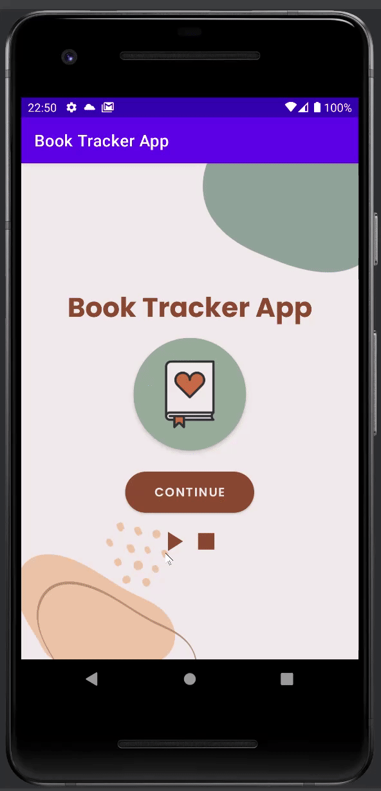
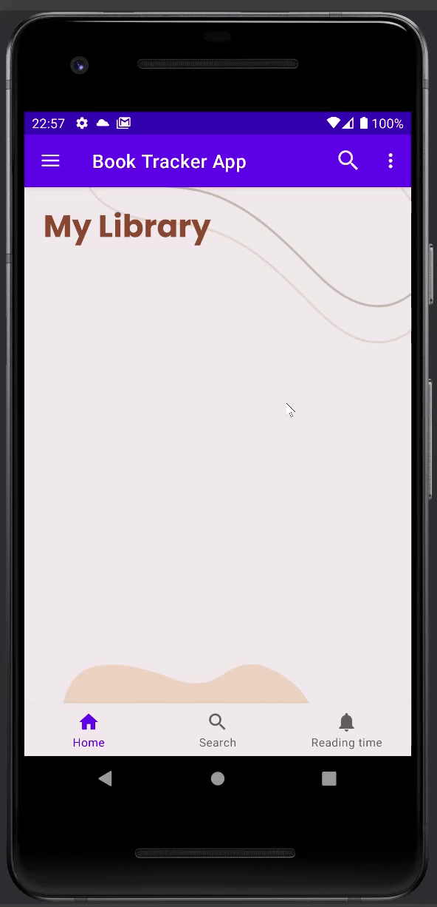
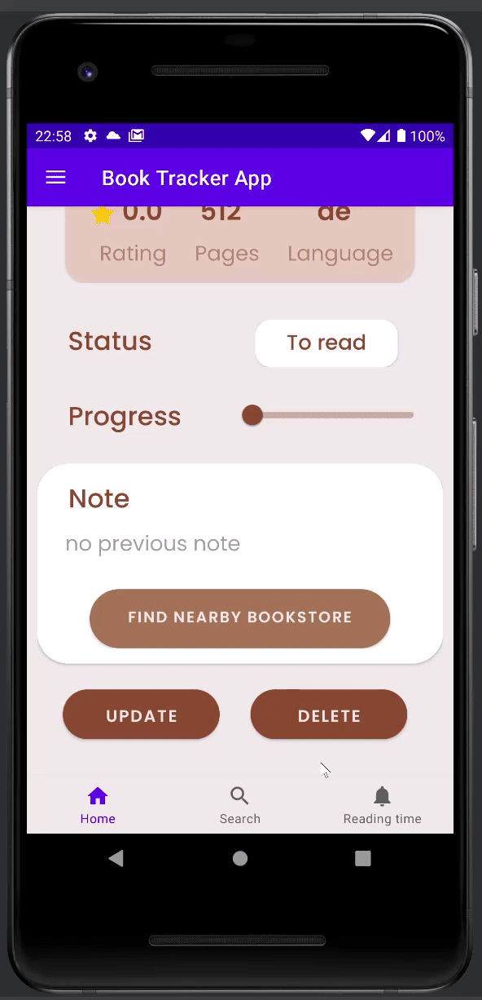
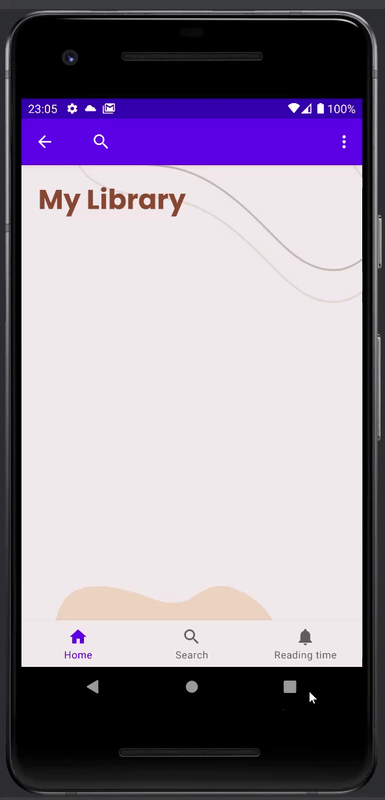

# Book Tracker App

> Everyone who loves reading

The Book Tracker App helps students as well as readers in general to manage their reading process. With this app users can keep track of reading plan and form reading habit.

## Motivation to develop app

Reading is a very good habit that one needs to develop in life. Good books can inform you, enlighten you and lead you in the right direction. This is also a way to relax and reduce stress. It is important to read a good book at least for a few minutes each day to stretch the brain muscles for healthy functioning.

## Hints
- To use this app, you need to connect to the Internet and allow it to get your current location

---
## Demo

### Play background music
- Music will be played while using app
  

### Access screens
- Users will be able to access screens in many different ways (through NavigationView or Bottom Navigation)
  

### Seach and Add Book
- Users can search their favorite book by typing its title into the search task. After that the information about **status** and **current page** is required
- Here user can choose one of three status: *To read*, *Reading*, *Read*.
  **Current Page** only appears when **status** is *Reading*. In the case **status** is *To read*, **current page** is automatically set equal to *0* and *number of pages of the book* if **status** is *Read*
  

### See the list of added books and their details
- Users can achieve all the books of their library by swiping to refresh layout. Then they see all details of the book for instance: *rating*, *number of pages*, *language*, *status*.
- With two data: **current page** which is recently added and **number of pages** that is obtained from Google API, the progress of the reading of that book is automatically calculated. If **status** is *To read*, the progress will be equal to 0%, otherwise it is 100% when **status** is set *Read*. That means the user had already read this book.

### Update
- The **status** and **current page** will be here updated. Moreover users can write their thoughts as well as their favorite quotes from the book.

### Delete
- Users are able to not only delete the current book, but also delete multiple books or all the books from their library

### Set Alarm
- To develop the reading habit, reading everyday is therefore important. The app provides the function to set reading book time. At the time that had been set users will receive a notification that notifies it is reading time.

### Create Shortcuts
- Shortcuts will help the users access screens in a faster way.

